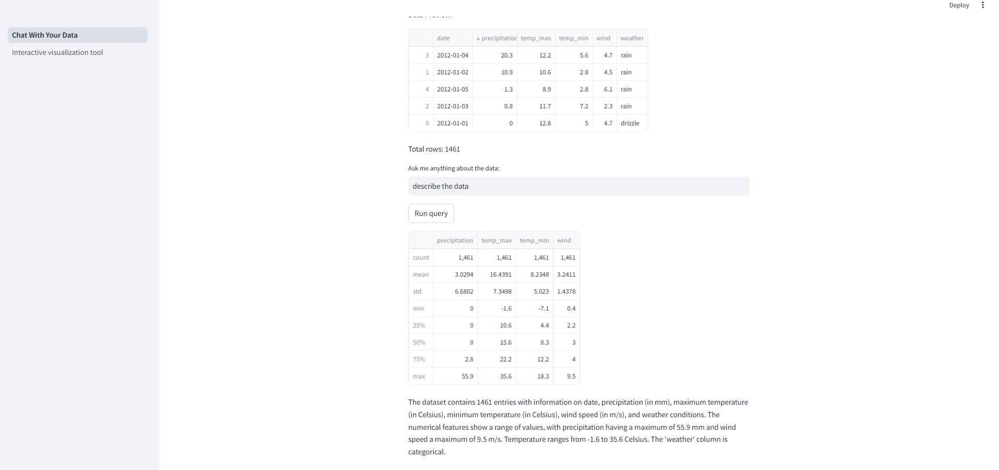
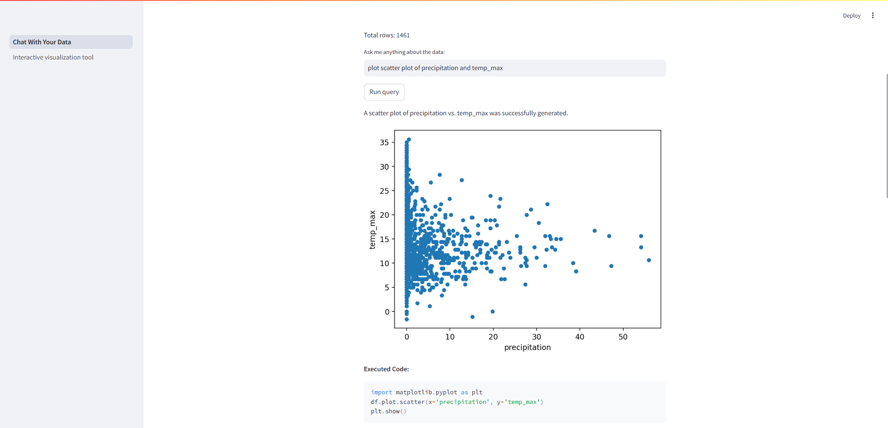
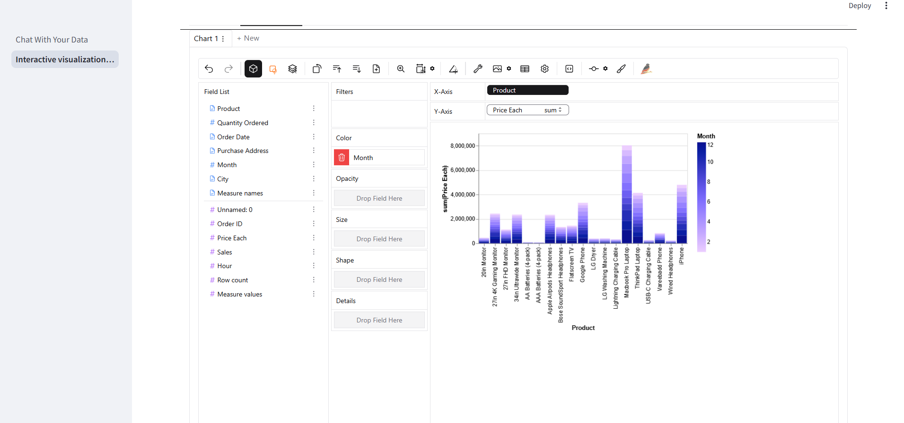

# CSV Data Analysis Chatbot with Agent
---

A conversational chatbot built using an intelligent Agent to assist users in analyzing CSV data files. The chatbot leverages natural language processing to understand user queries and performs data exploration, statistics calculation, and visualization tasks on CSV files.

## Project Overview
---

This project integrates an Agent-based chatbot with powerful data analysis libraries to:
- Load and preview CSV files.
- Compute basic statistics (mean, median, standard deviation, etc.).
- Generate data visualizations (histograms, scatter plots, line charts, etc.).
- Provide an interactive and conversational interface with PygWalker.

## Tools and Technologies
---

- **LangChain**: Framework for building LLM-powered agents.
- **Pandas**: Data manipulation and analysis.
- **NumPy**: Numerical computations.
- **Plotly/Matplotlib/Seaborn**: Data visualization.
- **Streamlit** (optional): Web framework for interactive demos.
- **GEMINI API**: For natural language processing and agent responses.

## Demo
---
Agent helps analyze data with input query:


Agent plot chart for visulization:


Interactive with data by PygWalker:


## Installation
---

1. **Clone the repo:**
```bash
git clone https://github.com/danielway2k3/data_analytic_agent.git
cd data_analytics
```

2. **Create and activate a virtual environment:**
```bash
python -m venv venv
# On Windows
venv\Scripts\activate
# On linux or MacOS
source venv/bin/activate
```

3. **Install the project dependencies:**
```bash
pip install -r requirements.txt
```

4. **Configure environment variables:**
    Creat file name .env in the root directory.
    Add your Gemini API key in .env file:
    ```
    GOOGLE_API_KEY=your_gemini_api_key
    ```

## Running the Chatbot Locally:
---

Run:
```bash
streamlit run 1_Chat_With_Your_Data.py
```
